<<<<<<< HEAD
# DSI-Cohort8-ML-2

Team project on ML

This repository covers team project for DSI Cohort 8 ML Project Team ML2.
The aim of the project is to create a model that can predict if a Customer will sign up for a Term load based on their input dataset collection of demographic data, financial data and previous campaign details. This project also aims to export the probability of the same.

```
├── data
├──── processed
├──── raw
├──── sql
├── experiments
├── models
├── reports
├── src
├── README.md
└── .gitignore
```

Data: Contains the raw, processed and final data. For any data living in a database, make sure to export the tables out into the sql folder, so it can be used by anyone else.
Experiments: A folder for experiments.
Models: A folder containing trained models or model predictions.
Reports: Generated HTML, PDF etc. of your report.
src: Project source code.
README: This file!
.gitignore: Files to exclude from this folder (e.g., large data files).

# Project Guiding Questions

Who is the intended audience for your project?

--Techinical and non-technical management personal of banking sector.

What is the question you will answer with your analysis?

--The aim of the project is to create a model that can predict if a Customer will sign up for a Term load based on their input dataset collection of demographic data, financial data and previous campaign details. This project also aims to export the probability of the same.

What are the key variables and attributes in your dataset?

--Demographic key variables are age, occupation, marital status and education level. Other attribute is customer default data, mortgage data, loan data, last contacted information, the outcome of last campaign.

Do you need to clean your data, and if so what is the best strategy?

--Initial scan of data seems good and we can start with data as is for now.

How can you explore the relationships between different variables?

--Using the model we can see the relationships between demographic and other attributes which can be highly weighted like default data, mortgage data and loan data.

What types of patterns or trends are in your data?

--There coulbe simple patterns like default customers will not take the term loan with being short on savings. There is high probability of pattern for customer contacted in last months who didnt sign up for term deposit will not sign up again if contact in short time like 1 month.

Are there any specific libraries or frameworks that are well-suited to your project requirements?

--we will use data set, pandas, numpy to extract all data. we will use sklearn.model_selection for test and train data to compite and train the model. Additional Details will be added here.

# Who are Stakeholders? and why do they care?

Primary Stakeholders (Direct Users)
--Marketing Team — decides whom to contact
--Campaign Managers — plan outreach strategy
--Sales Agents / Call Center Teams — execute whom to calls

Secondary Stakeholders (Decision Makers)
--Business Executives — care about ROI and revenue
--Finance Team — monitors campaign costs
--Data Science Team — maintains model

Tertiary Stakeholders (Indirect Impact)
--Customers — receive more relevant offers
--Compliance/Risk Teams — ensure ethical targeting

# How to use data set to define stakeholder relevent information

--The dataset is well-structured, complete, and suitable for machine learning modeling. Although it contains no explicit missing values, certain categorical placeholders represent implicit missing data and must be handled carefully. Additionally, variables such as call duration introduce data leakage and should be excluded. Despite limitations such as class imbalance and lack of detailed behavioral financial information, the dataset provides sufficient demographic, economic, and campaign features to successfully build a predictive classification model for term deposit subscription.

# Risks and Uncertainities of data set

Although suitable for modeling, the dataset has some constraints:

### Limited Behavioral Data

The dataset does not include:

- transaction history
- spending patterns
- credit score
- digital activity
  These features could significantly improve prediction quality.

---

### No Time-Series Structure

## The dataset does not capture chronological behavioral trends. Therefore, models cannot learn temporal patterns such as customer behavior changes over time.

### Single Source Dataset

The data comes from one financial institution. Models trained on it may not generalize well to:

- other banks
- different regions
- different economic conditions

---

### No Profit or Revenue Information

The dataset predicts subscription likelihood but does not include financial value indicators such as:

- customer lifetime value
- revenue per customer
- product profitability
  This limits business optimization analysis.

# Methods and Technologies we will use?

# Machine Learning Guiding Details

What are the specific objectives and success criteria for your machine learning model?

How can you select the most relevant features for training?

Are there any missing values or outliers that need to be addressed through preprocessing?

Which machine learning algorithms are suitable for the problem domain?

What techniques are available to validate and tune the hyperparameters?

How should the data be split into training, validation, and test sets?

Are there any ethical implications or biases associated with the machine learning model?

How can you document the machine learning pipeline and model architecture for future reference?
=======
<p align="center">
  
  
  
  
  
  
  
</p>

<h1 align="center">Predicting Term Deposit Subscription</h1>
<p align="center"><b>Data Science Institute — Cohort 8 — ML Team 2</b></p>

---

## Table of Contents

- [Project Overview and Purpose](#project-overview-and-purpose)
- [Business Problem](#business-problem)
- [Business Objectives and Goals](#business-objectives-and-goals)
- [Dataset Details](#dataset-details)
- [Risks and Unknowns](#risks-and-unknowns)
- [How We Approached the Analysis](#how-we-approached-the-analysis)
- [Key Results](#key-results)
- [Repository Structure](#repository-structure)
- [Local Setup](#local-setup)
- [Team Roles and Responsibilities](#team-roles-and-responsibilities)
- [Reflection Videos](#reflection-videos)
- [Acknowledgments](#acknowledgments)

---

## Project Overview and Purpose

This project tackles a real-world problem that banks face every day: figuring out which customers to call during a marketing campaign. Right now, banks call almost everyone on their list, which means most calls go to people who will never sign up. That wastes time, money, and burns out call centre staff.

We built a machine learning system that looks at a customer's profile — their age, job, whether they have loans, how the economy is doing — and predicts whether that person is likely to subscribe to a term deposit. Instead of calling everyone, the bank can now focus on the people most likely to say yes.

The entire system runs with a single command. It downloads the data, cleans it, trains multiple models, picks the best one, and generates a dashboard where non-technical stakeholders can see results, understand why the model makes its decisions, and even score new customers in real time.

---

## Business Problem

A bank runs phone-based marketing campaigns to sell term deposits (a type of savings product where the customer locks in their money for a fixed period at a guaranteed interest rate). The current process looks like this:

- The bank has a list of existing customers.
- Call centre agents work through the list, calling each person to pitch the term deposit.
- Out of every 100 calls, roughly 11 people subscribe. The other 89 calls are wasted.
- Each call costs the bank approximately $5 in agent time and phone charges.
- Each new subscriber generates approximately $200 in lifetime value through the bank's net interest margin (the difference between what the bank pays the depositor and what it earns by lending those funds out).

The core issue is **asymmetry**: missing a potential subscriber costs the bank 40 times more than making a wasted call. A single missed subscriber is $200 in lost revenue. A wasted call is just $5. This means the bank should lean toward calling more people rather than fewer — but it still needs to be smarter than calling everyone.

**Where these cost numbers come from:**

We did not pick $200 and $5 arbitrarily. We derived them from actual banking economics:

| Parameter                                   | Value   | Source                                                                                                |
| ------------------------------------------- | ------- | ----------------------------------------------------------------------------------------------------- |
| Average term deposit amount                 | $10,000 | Industry standard for retail banking                                                                  |
| Interest paid to depositor                  | 2.0%    | Typical fixed deposit rate                                                                            |
| Interest earned on lending                  | 8.4%    | Average retail lending rate                                                                           |
| Net Interest Margin                         | 6.4%    | 8.4% minus 2.0%                                                                                       |
| Annual NIM revenue per subscriber           | $640    | $10,000 x 6.4%                                                                                        |
| Lifetime revenue (2-year average term)      | $1,280  | $640 x 2 years                                                                                        |
| Conservative per-subscriber value (FN cost) | $200    | Adjusted down from $1,280 to account for conversion uncertainty, early withdrawal, and customer churn |
| Call cost (FP cost)                         | $5      | Agent time plus telephony infrastructure                                                              |
| Cost ratio (FN to FP)                       | 40:1    | $200 / $5                                                                                             |

---

## Business Objectives and Goals

We set out to answer four questions:

1. **Who should the bank call?** — Build a model that scores every customer by their likelihood to subscribe, so the marketing team can prioritize high-probability leads and skip the rest.

2. **How much money does this save?** — Translate model performance into actual dollar impact. We want to show the CFO a clear before-and-after comparison: here is what you spend now, and here is what you would spend with ML targeting.

3. **Why does the model make its predictions?** — Use SHAP (a model explanation method) to show which factors push a customer toward subscribing or not. This gives the marketing team actionable insight — not just "call this person" but "call this person because they are a retiree who was contacted via mobile during a low interest rate period."

4. **Can we trust the model's probabilities?** — A model that says "70% chance of subscribing" should be right about 70% of the time. We measure this through calibration analysis, so stakeholders know whether to take the numbers at face value.

**Who benefits from this system:**

| Stakeholder         | What They Get                                                |
| ------------------- | ------------------------------------------------------------ |
| Marketing Director  | A ranked list of who to call first, with reasons             |
| Call Centre Manager | Smaller, higher-quality call lists that reduce agent burnout |
| CFO                 | Measurable ROI — dollars saved per campaign cycle            |
| Compliance / Ethics | Transparent, explainable predictions (no black box)          |

---

## Dataset Details

**Source:** [UCI Machine Learning Repository — Bank Marketing Dataset](https://archive.ics.uci.edu/dataset/222/bank+marketing)

**Citation:** Moro et al., 2014. "A data-driven approach to predict the success of bank telemarketing." Decision Support Systems, Elsevier.

**License:** CC BY 4.0

| Property        | Value                                                        |
| --------------- | ------------------------------------------------------------ |
| Total records   | 41,188                                                       |
| Features        | 20 input + 1 target                                          |
| Target variable | `y` — did the client subscribe to a term deposit? (yes / no) |
| Positive rate   | 11.3% (heavily imbalanced)                                   |
| Time period     | May 2008 to November 2010                                    |
| Geography       | Portugal                                                     |
| File format     | CSV, semicolon-delimited, inside a nested ZIP archive        |

### Feature Categories

**Client attributes (7 features):**
These describe who the customer is. Age, job type, marital status, education level, whether they have credit in default, a housing loan, or a personal loan.

**Campaign attributes (7 features):**
These describe the current and past marketing interactions. How the customer was contacted (phone or mobile), which month and day of the week the call was made, how many times they have been called this campaign, how many days since the last contact, how many times they were contacted in previous campaigns, and what happened in the previous campaign (success, failure, or no previous campaign).

**Economic indicators (5 features):**
These capture the macroeconomic environment at the time of the call. Employment variation rate, consumer price index, consumer confidence index, the 3-month Euribor interest rate, and the number of employees in the economy. These turned out to be among the strongest predictors — when interest rates are low and the economy is uncertain, people are more receptive to safe savings products.

### The Duration Problem

There is one feature in this dataset that requires special attention: `duration`, which records how long each phone call lasted (in seconds). At first glance, it looks like a powerful predictor — and it is. Longer calls tend to result in subscriptions.

But here is the catch: you only know how long a call lasted **after the call has ended**. If we are trying to predict who to call **before** the campaign starts, call duration does not exist yet. Including it in a predictive model is data leakage — the model looks incredible on paper but would be useless in practice.

The UCI dataset documentation explicitly warns about this. We dropped `duration` from all production models. We do not use it anywhere in our predictions.

---

## Risks and Unknowns

We identified the following risks during our analysis and documented how we addressed each one:

### Data Quality Risks

| Risk                                  | What We Found                                                                                                               | How We Handled It                                                                                                                                                                                                                                                                                          |
| ------------------------------------- | --------------------------------------------------------------------------------------------------------------------------- | ---------------------------------------------------------------------------------------------------------------------------------------------------------------------------------------------------------------------------------------------------------------------------------------------------------- |
| **Missing values coded as "unknown"** | Six columns contain "unknown" entries instead of NaN. The worst is `default` at 20.9%.                                      | For columns with few unknowns (`job`, `marital`, `housing`, `loan`), we imputed with the most common value. For `education` and `default`, we kept "unknown" as its own category because it may carry signal — a bank not knowing a customer's credit default status is itself informative.                |
| **Class imbalance**                   | Only 11.3% of customers subscribed. A model that predicts "no" for everyone would be 88.7% accurate but completely useless. | We used class weighting in all models (`class_weight='balanced'` for scikit-learn models, `scale_pos_weight` for XGBoost) so the model penalizes misses on the minority class more heavily. We avoided synthetic oversampling (SMOTE) because it can inflate cross-validation scores with artificial data. |
| **Outliers**                          | `campaign` (number of calls) has extreme values — some customers were called 40+ times. `previous` is heavily right-skewed. | We clip numeric features at the 1st and 99th percentiles. This reduces extreme value influence on logistic regression without removing rows (which would lose minority-class samples). Tree models are naturally robust to outliers.                                                                       |
| **Duplicate rows**                    | Checked for exact duplicate records.                                                                                        | Duplicates are detected and removed automatically during cleaning.                                                                                                                                                                                                                                         |
| **Multicollinearity**                 | `euribor3m`, `emp.var.rate`, and `nr.employed` are correlated above 0.9 — they all reflect the state of the economy.        | We report this but do not drop features. Tree models are unaffected by correlated inputs, and logistic regression uses L1 regularization which naturally zeroes out redundant features.                                                                                                                    |

### Modeling Risks

| Risk                                 | Impact                                                                                                                                                                                                                     | Mitigation                                                                                                                                                                                                                     |
| ------------------------------------ | -------------------------------------------------------------------------------------------------------------------------------------------------------------------------------------------------------------------------- | ------------------------------------------------------------------------------------------------------------------------------------------------------------------------------------------------------------------------------ |
| **Duration leakage**                 | Including call duration would inflate all metrics by 15-20 percentage points but produce a model that cannot be used in practice.                                                                                          | Dropped `duration` from all production models.                                                                                                                                                                                 |
| **Overfitting**                      | With 30 Optuna trials per model, there is a risk of overfitting to the validation set.                                                                                                                                     | We use 5-fold stratified cross-validation during tuning. The validation set is used only for threshold selection. The test set is touched exactly once for final reporting.                                                    |
| **Cost assumption sensitivity**      | Our profit calculations depend on the $200 FN and $5 FP estimates. If these are wrong, the "best" model might change.                                                                                                      | We run a sensitivity analysis that tests model selection under eight different criteria and weight profiles. If the same model wins across all of them, we have confidence the selection is robust.                            |
| **Economic regime change**           | The dataset covers 2008-2010 (during and after the financial crisis). Models trained on this period may not generalize to fundamentally different economic conditions.                                                     | We include macroeconomic features (Euribor rate, employment) so the model can adapt to changing conditions. However, we flag that retraining would be needed if deployed in a different economic era.                          |
| **Non-linear feature relationships** | Age has a U-shaped relationship with subscription (young students and older retirees subscribe more than middle-aged working adults). Campaign calls show diminishing returns. Standard linear models miss these patterns. | We added a custom binning transformer that creates categorical bins for age, campaign, and euribor3m based on domain knowledge. This helps logistic regression capture non-linear effects while being neutral for tree models. |

---

## How We Approached the Analysis

### Pipeline Architecture

The entire analysis will be automated through a single Python script that will execute the following steps in order:

```mermaid
%%{init: {'theme': 'base', 'themeVariables': { 'primaryColor': '#FFE0F7', 'primaryBorderColor': '#7C3AED', 'primaryTextColor': '#1F2937', 'lineColor': '#4B5563', 'secondaryColor': '#D1FAE5', 'tertiaryColor': '#DBEAFE', 'fontSize': '13px' }}}%%
flowchart LR
  %% ======== Data Layer ========
  UCI([UCI Bank Marketing<br/>Nested ZIP])
  INGEST[Ingest<br/>Auto-download + extract]
  CLEAN[Clean<br/>Unknown handling + clipping + de-dup]
  SPLIT[Stratified Split<br/>70 / 15 / 15]
  FEAT[Feature Engineering<br/>pdays transform + custom binning]

  %% ======== Modeling Layer ========
  TUNE[Optuna Tuning<br/>30 trials per model]
  TRAIN[Train Models<br/>LR · RF · XGB · LGBM · Voting]
  THRESH[Threshold Optimization<br/>Cost-sensitive: FP $5 / FN $200]
  SELECT[Composite Selection<br/>Profit 40% + Recall 25% + AUC 20% + Calibration 15%]

  %% ======== Explainability + Serving Layer ========
  SHAP[SHAP Analysis<br/>TreeExplainer]
  DASH[Stakeholder Dashboard<br/>Streamlit · 5 tabs]

  %% ======== Artifacts ========
  subgraph ART[Generated Artifacts]
    MODELS[(Models<br/>.joblib)]
    METRICS[(Metrics<br/>comparison.json / recall_analysis.csv)]
    FIGS[(Figures<br/>18+ plots)]
  end

  %% ======== Main Flow ========
  UCI --> INGEST --> CLEAN --> SPLIT --> FEAT --> TUNE --> TRAIN --> THRESH --> SELECT --> SHAP --> DASH
  TRAIN --> MODELS
  SELECT --> METRICS
  SHAP --> FIGS

  %% ======== Styling ========
  classDef data fill:#DBEAFE,stroke:#2563EB,stroke-width:3px,color:#0F172A;
  classDef prep fill:#D1FAE5,stroke:#059669,stroke-width:3px,color:#052E16;
  classDef model fill:#FDE68A,stroke:#D97706,stroke-width:3px,color:#451A03;
  classDef decision fill:#E9D5FF,stroke:#7C3AED,stroke-width:3px,color:#2E1065;
  classDef explain fill:#FBCFE8,stroke:#DB2777,stroke-width:3px,color:#500724;
  classDef serving fill:#CFFAFE,stroke:#0891B2,stroke-width:3px,color:#083344;
  classDef artifact fill:#FEF3C7,stroke:#F59E0B,stroke-width:3px,color:#78350F;

  class UCI,INGEST data;
  class CLEAN,SPLIT,FEAT prep;
  class TUNE,TRAIN,THRESH model;
  class SELECT decision;
  class SHAP explain;
  class DASH serving;
  class MODELS,METRICS,FIGS artifact;

```



### Why These Models

We will use four individual models plus one ensemble:

| Model               | Role in the Pipeline               | Strength                                                                                                                 |
| ------------------- | ---------------------------------- | ------------------------------------------------------------------------------------------------------------------------ |
| Logistic Regression | Interpretable baseline             | Coefficients map directly to odds ratios. Fast to train. Stakeholders can understand it without ML background.           |
| Random Forest       | Robust ensemble                    | Averages hundreds of decision trees. Resistant to overfitting. Handles mixed feature types well.                         |
| XGBoost             | High-performance gradient boosting | Typically the strongest performer on structured/tabular data. Explicit support for class imbalance.                      |
| LightGBM            | Alternative gradient boosting      | Faster training than XGBoost on large datasets. Leaf-wise tree growth often finds better splits.                         |
| Voting Ensemble     | Diversity-based combination        | Soft vote across logistic regression + best tree model + second tree model. Combines linear and non-linear perspectives. |

### Why Composite Scoring Instead of Just Picking the Highest Accuracy

Accuracy is misleading on imbalanced data — a model that always predicts "no" gets 88.7% accuracy but catches zero subscribers. We also avoid picking the model with the highest single metric (like profit or AUC) because:

- Profit depends on our cost assumptions. If those assumptions shift, the winner could change.
- AUC measures overall ranking quality but ignores the specific threshold we use in production.
- Recall can be trivially maximized by predicting everyone as positive.

Instead, we combine four metrics into a weighted composite score. The weights reflect what matters most to the business: profit is weighted highest (40%), followed by recall (25%), AUC (20%), and calibration quality (15%). We then verify the selection is stable by testing it under eight different weighting schemes.

---

## Key Results

### Model Performance (Test Set — No Duration) - _place holder to be updated in future_

| Model               | Accuracy | Precision | Recall | F1 Score |
| ------------------- | -------- | --------- | ------ | -------- |
| **Random Forest**   |          |           |        |          |
| Logistic Regression |          |           |        |          |
| XGBoost             |          |           |        |          |
| LightGBM            |          |           |        |          |
| Voting Ensemble     |          |           |        |          |

_Exact values will be generated when the pipeline runs._

---

## Repository Structure

#### _place holder to be updated in future_

```
DSI-Cohort8-ML-2/
|
|-- app/
|-- data/
|   |-- processed/
|   |-- raw/
|   |-- reference/
|-- experiments/
|-- models/
|-- reports/
|   |-- figures/
|   |-- metrics/
|-- scripts/
|-- src/
|-- tests/
|-- requirements.txt
|-- pyproject.toml
|-- setup.md
|-- .gitignore
|-- README.md
```

---

## Local Setup

### Prerequisites

- Python 3.12
- uv

### Setup and Run

```bash
# 1. Clone the repository
git clone https://github.com/ashutosh-ranjan2611/DSI-Cohort8-ML-2.git
cd DSI-Cohort8-ML-2

# 2. Create a virtual environment
uv venv .venv --python 3.12
source .venv/bin/activate          # macOS / Linux
.venv\Scripts\activate             # Windows

# 3. Install dependencies
uv sync --active
```

---

## Team Roles and Responsibilities

Our team of four split the work across the major components of the project. While everyone contributed to discussions and code reviews, each person took primary ownership of specific areas.

| Member              | Primary Responsibility                             | Deliverables                                                                                                                                                                                                                                                                               |
| ------------------- | -------------------------------------------------- | ------------------------------------------------------------------------------------------------------------------------------------------------------------------------------------------------------------------------------------------------------------------------------------------ |
| **Neha Bondade**    | Data pipeline and cleaning                         | Building the data ingestion module that handles the nested ZIP extraction from UCI. Designing the cleaning strategy — the per-column unknown handling rules, outlier clipping approach, and data quality checks (duplicates, skewness, multicollinearity, cardinality).                    |
| **Suresh Jannu**    | Model training and tuning                          | Implementing the training pipeline with Optuna hyperparameter search for all four model types. Defining the search spaces, configuring class imbalance handling, and building the before-versus-after tuning comparison.                                                                   |
| **Pavan**           | Evaluation and explainability                      | Designing the composite model selection framework with the weighted scoring approach. Building the banking economics cost derivation, threshold optimization, sensitivity analysis, and recall trade-off analysis. Implementing SHAP explainability with business-friendly feature labels. |
| **Ashutosh Ranjan** | Integration, Dashboard, documentation, and testing | Will design and develop end-to-end final code for the project. Building the Streamlit dashboard with five stakeholder tabs (Executive Summary, Call Centre Operations, Model and Data Science, Predict Client, Batch Predict).                                                             |

### How We Collaborated

- All code changes went through pull requests on GitHub with at least one reviewer before merging.
- We held weekly standups to sync on progress and blockers.
- Major design decisions were discussed and agreed upon as a team before implementation.

---

## Reflection Videos

#### _place holder to be updated in future_

- [Neha Bondade — Reflection Video](https://youtube.com/placeholder)
- [Suresh Jannu — Reflection Video](https://youtube.com/placeholder)
- [Pavan — Reflection Video](https://youtube.com/placeholder)
- [Ashutosh Ranjan — Reflection Video](https://youtube.com/placeholder)

---

## Week 2 - WIP

#### _place holder to be updated in future_

---

## Acknowledgments

- **Dataset:** [UCI Machine Learning Repository — Bank Marketing](https://archive.ics.uci.edu/dataset/222/bank+marketing)
- **Original research:** Moro, S., Cortez, P., and Rita, P. (2014). "A data-driven approach to predict the success of bank telemarketing." Decision Support Systems, 62, 22-31.
- **Course:** Data Science Institute, University of Toronto — Cohort 8
- **Tools:** scikit-learn, XGBoost, LightGBM, Optuna, SHAP, Streamlit, Plotly

---

<p align="center"><i>Built by DSI Cohort 8 — ML Team 2</i></p>
>>>>>>> e74a3a3 (Initial commit for EDA)
