<h1 align="center">Call Smarter: Predicting Term Deposit Subscribers</h1>
<p align="center"><b>Data Science Institute — Cohort 8 — ML Team 2</b></p>
<p align="center">
  
  
  
  
  
  
  
  
  
  
  
</p>

---

## Table of Contents

- [Executive Summary](#executive-summary)
- [Project Overview and Purpose](#project-overview-and-purpose)
- [Business Problem](#business-problem)
- [Business Objectives and Goals](#business-objectives-and-goals)
- [Dataset Details](#dataset-details)
- [Exploratory Data Analysis (EDA)](#exploratory-data-analysis-eda)
- [Summary: Data Cleaning and Preprocessing](#summary-data-cleaning-and-preprocessing)
- [Risks and Unknowns](#risks-and-unknowns)
- [How We Approached the Analysis](#how-we-approached-the-analysis)
- [Handling Imbalanced Data](#handling-imbalanced-data)
- [Model Development](#model-development)
- [Key Results](#key-results)
- [Pipeline Architecture](#pipeline-architecture)
- [Repository Structure](#folder-reference)
- [Local Setup](#local-setup)
- [Model Deployment and Interpretation](#model-deployment-and-interpretation)
- [Requirements and Technology Stack](#requirements-and-technology-stack)
- [Installation and Running the App](#installation-and-running-the-app)
- [Team Roles and Responsibilities](#team-roles-and-responsibilities)
- [Reflection Videos](#reflection-videos)
- [Conclusion and Future Directions](#conclusion-and-future-directions)
- [Acknowledgments](#acknowledgments)

---

### Business / CFO Visuals

<p align="center">
  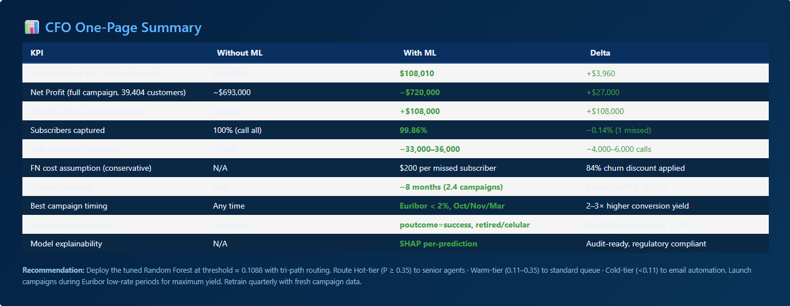
  &nbsp;&nbsp;
  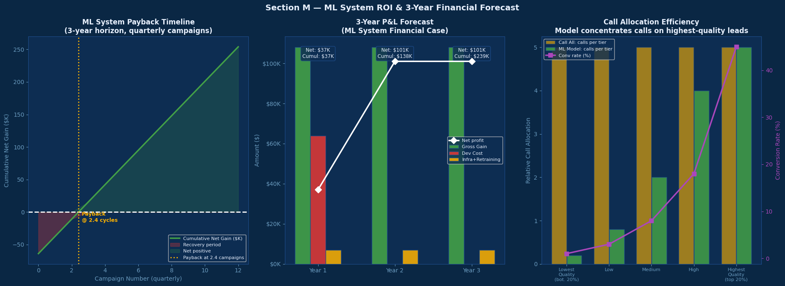
  <br><em>Executive summary visuals: CFO net-profit summary and ROI breakdown.</em>
</p>

## Project Overview and Purpose

This project tackles a real-world problem that banks face every day: figuring out which customers to call during a marketing campaign. Right now, banks call almost everyone on their list, which means most calls go to people who will never sign up. That wastes time, money, and burns out call centre staff.

We built a machine learning system that looks at a customer's profile — their age, job, whether they have loans, how the economy is doing — and predicts whether that person is likely to subscribe to a term deposit. Instead of calling everyone, the bank can now focus on the people most likely to say yes.

The entire system runs with a single command. It downloads the data, cleans it, trains multiple models, picks the best one, and generates a dashboard where non-technical stakeholders can see results, understand why the model makes its decisions, and even score new customers in real time.

---

## Business Problem

A bank runs phone-based marketing campaigns to sell term deposits (a type of savings product where the customer locks in their money for a fixed period at a guaranteed interest rate). The current process looks like this:

- The bank has a list of existing customers.
- Call centre agents work through the list, calling each person to pitch the term deposit.
- Out of every 100 calls, roughly 11 people subscribe. The other 89 calls are wasted.
- Each call costs the bank approximately $5 in agent time and phone charges.
- Each new subscriber generates approximately $200 in lifetime value through the bank's net interest margin (the difference between what the bank pays the depositor and what it earns by lending those funds out).

The core issue is **asymmetry**: missing a potential subscriber costs the bank 40 times more than making a wasted call. A single missed subscriber is $200 in lost revenue. A wasted call is just $5. This means the bank should lean toward calling more people rather than fewer — but it still needs to be smarter than calling everyone.

**Where these cost numbers come from:**

We did not pick $200 and $5 arbitrarily. We derived them from actual banking economics:

| Parameter                                   | Value   | Source                                                                                                |
| ------------------------------------------- | ------- | ----------------------------------------------------------------------------------------------------- |
| Average term deposit amount                 | $10,000 | Industry standard for retail banking                                                                  |
| Interest paid to depositor                  | 2.0%    | Typical fixed deposit rate                                                                            |
| Interest earned on lending                  | 8.4%    | Average retail lending rate                                                                           |
| Net Interest Margin                         | 6.4%    | 8.4% minus 2.0%                                                                                       |
| Annual NIM revenue per subscriber           | $640    | $10,000 x 6.4%                                                                                        |
| Lifetime revenue (2-year average term)      | $1,280  | $640 x 2 years                                                                                        |
| Conservative per-subscriber value (FN cost) | $200    | Adjusted down from $1,280 to account for conversion uncertainty, early withdrawal, and customer churn |
| Call cost (FP cost)                         | $5      | Agent time plus telephony infrastructure                                                              |
| Cost ratio (FN to FP)                       | 40:1    | $200 / $5                                                                                             |

---

## Business Objectives and Goals

We set out to answer four questions:

1. **Who should the bank call?** - Build a model that scores every customer by their likelihood to subscribe, so the marketing team can prioritize high-probability leads and skip the rest.

2. **How much money does this save?** - Translate model performance into actual dollar impact. We want to show the CFO a clear before-and-after comparison: here is what you spend now, and here is what you would spend with ML targeting.

3. **Why does the model make its predictions?** - Use SHAP (a model explanation method) to show which factors push a customer toward subscribing or not. This gives the marketing team actionable insight — not just "call this person" but "call this person because they are a retiree who was contacted via mobile during a low interest rate period."

4. **Can we trust the model's probabilities?** - A model that says "70% chance of subscribing" should be right about 70% of the time. We measure this through calibration analysis, so stakeholders know whether to take the numbers at face value.

**Who benefits from this system:**

| Stakeholder         | What They Get                                                |
| ------------------- | ------------------------------------------------------------ |
| Marketing Director  | A ranked list of who to call first, with reasons             |
| Call Centre Manager | Smaller, higher-quality call lists that reduce agent burnout |
| CFO                 | Measurable ROI — dollars saved per campaign cycle            |
| Compliance / Ethics | Transparent, explainable predictions (no black box)          |

---

## Dataset Details

**Source:** [UCI Machine Learning Repository — Bank Marketing Dataset](https://archive.ics.uci.edu/dataset/222/bank+marketing)

**Citation:** Moro et al., 2014. "A data-driven approach to predict the success of bank telemarketing." Decision Support Systems, Elsevier.

**License:** CC BY 4.0

| Property        | Value                                                                    |
| --------------- | ------------------------------------------------------------------------ |
| Total records   | 41,188                                                                   |
| Features        | 20 input + 1 target                                                      |
| Target variable | `y` — did the client subscribe to a term deposit? (yes / no)             |
| Positive rate   | 11.7% (heavily imbalanced — after dropping `duration` and deduplication) |
| Time period     | May 2008 to November 2010                                                |
| Geography       | Portugal                                                                 |
| File format     | CSV, semicolon-delimited, inside a nested ZIP archive                    |

### Feature Categories

**Client attributes (7 features):**
These describe who the customer is. Age, job type, marital status, education level, whether they have credit in default, a housing loan, or a personal loan.

**Campaign attributes (7 features):**
These describe the current and past marketing interactions. How the customer was contacted (phone or mobile), which month and day of the week the call was made, how many times they have been called this campaign, how many days since the last contact, how many times they were contacted in previous campaigns, and what happened in the previous campaign (success, failure, or no previous campaign).

**Economic indicators (5 features):**
These capture the macroeconomic environment at the time of the call. Employment variation rate, consumer price index, consumer confidence index, the 3-month Euribor interest rate, and the number of employees in the economy. These turned out to be among the strongest predictors — when interest rates are low and the economy is uncertain, people are more receptive to safe savings products.

### The Duration Problem

There is one feature in this dataset that requires special attention: `duration`, which records how long each phone call lasted (in seconds). At first glance, it looks like a powerful predictor — and it is. Longer calls tend to result in subscriptions.

But here is the catch: you only know how long a call lasted **after the call has ended**. If we are trying to predict who to call **before** the campaign starts, call duration does not exist yet. Including it in a predictive model is data leakage — the model looks incredible on paper but would be useless in practice.

The UCI dataset documentation explicitly warns about this. We dropped `duration` from all production models. We do not use it anywhere in our predictions.

---

## Exploratory Data Analysis (EDA)

Before building any models, we conducted a thorough exploration of the dataset to understand its structure, quality, and key relationships. The full analysis is in [`experiments/full_analysis.ipynb`](experiments/full_analysis.ipynb).

### Target Variable Distribution

The target variable `y` is heavily imbalanced:

| Class                  | Count  | Percentage |
| ---------------------- | ------ | ---------- |
| No (did not subscribe) | 36,548 | 88.7%      |
| Yes (subscribed)       | 4,640  | 11.7%      |

<p align="center">
  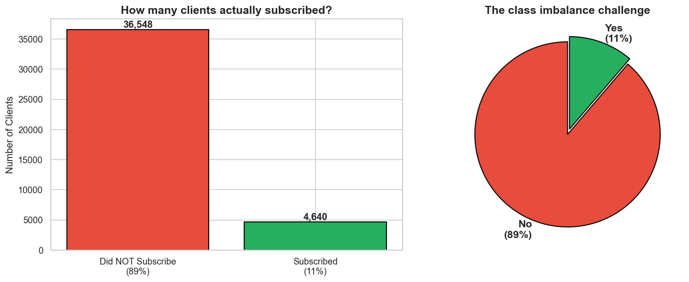
  <br><em>Class distribution — 88.7% non-subscribers vs 11.7% subscribers</em>
</p>

This severe imbalance means a naive model predicting "no" for everyone achieves 88.7% accuracy but catches zero subscribers. We addressed this with class weighting and cost-optimal threshold tuning (see [Handling Imbalanced Data](#handling-imbalanced-data)).

### Numeric Feature Overview

| Feature        | Mean  | Min   | Max   | Notes                                               |
| -------------- | ----- | ----- | ----- | --------------------------------------------------- |
| age            | 40.0  | 17    | 98    | Wide range; U-shaped relationship with subscription |
| campaign       | 2.57  | 1     | 56    | Right-skewed; diminishing returns after ~5 calls    |
| pdays          | 962.5 | 0     | 999   | 999 = never previously contacted (sentinel value)   |
| previous       | 0.17  | 0     | 7     | Most customers have zero prior contacts             |
| emp.var.rate   | 0.08  | -3.4  | 1.4   | Employment variation rate (quarterly)               |
| cons.price.idx | 93.6  | 92.2  | 94.8  | Consumer price index (monthly)                      |
| cons.conf.idx  | -40.5 | -50.8 | -26.9 | Consumer confidence index (monthly)                 |
| euribor3m      | 3.62  | 0.63  | 5.04  | 3-month Euribor rate — strong predictor             |
| nr.employed    | 5167  | 4964  | 5228  | Number of employees (quarterly)                     |

<p align="center">
  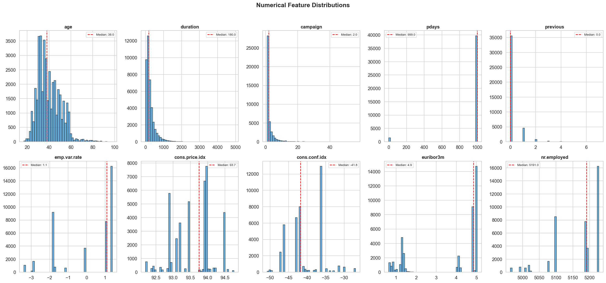
  <br><em>Numerical feature distributions across the dataset</em>
</p>

### Key EDA Findings

- **Duration is a leaky feature:** Call duration is the strongest predictor of subscription, but it is only known after the call ends. Including it would inflate metrics by 15–20 percentage points. We dropped it from all production models (see [The Duration Problem](#the-duration-problem)).
- **Macroeconomic features dominate:** `euribor3m`, `emp.var.rate`, and `nr.employed` are among the top predictors. When interest rates are low and the economy is uncertain, customers are more receptive to safe savings products.
- **High multicollinearity among economic indicators:** `euribor3m`, `emp.var.rate`, and `nr.employed` are correlated above 0.9. We report this but do not drop features — tree models handle collinearity naturally, and Logistic Regression uses L1 regularization.
- **Contact history matters:** Customers with a successful previous campaign outcome (`poutcome = success`) are far more likely to subscribe again.
- **Age has a U-shaped pattern:** Young students and older retirees subscribe at higher rates than middle-aged working adults.
- **Campaign fatigue:** Subscription probability decreases after approximately 5 contact attempts in the same campaign.
- **Outliers present:** `campaign` has extreme values (up to 56 calls). We clip numeric features at the 1st and 99th percentiles during preprocessing.

<p align="center">
  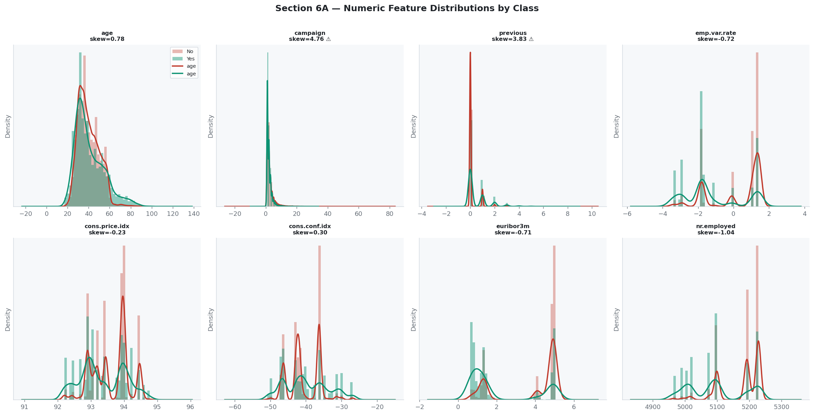
  <br><em>Distribution of numeric features — note right-skewed campaign and the 999 sentinel in pdays</em>
</p>

<p align="center">
  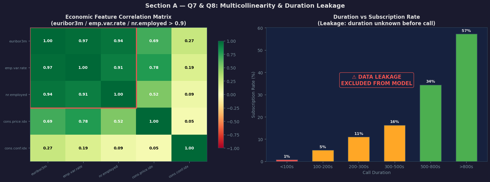
  <br><em>Multicollinearity among economic indicators and data leakage analysis (duration excluded)</em>
</p>

<p align="center">
  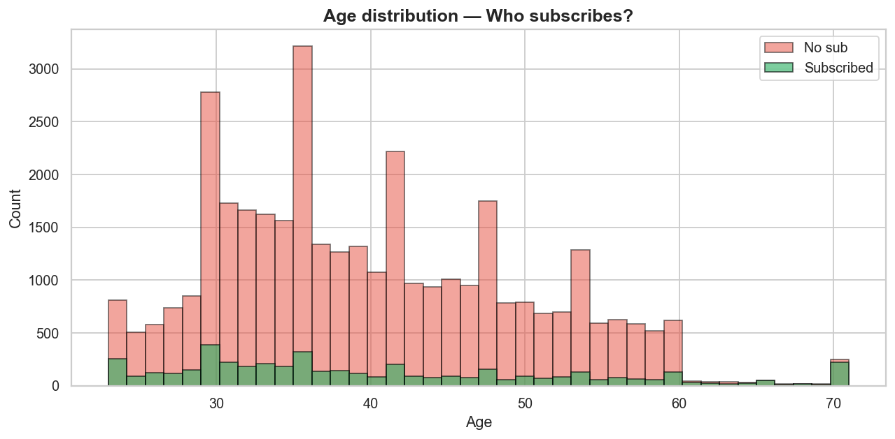
  <br><em>Age distribution — U-shaped subscription pattern (students and retirees subscribe at higher rates)</em>
</p>

<p align="center">
  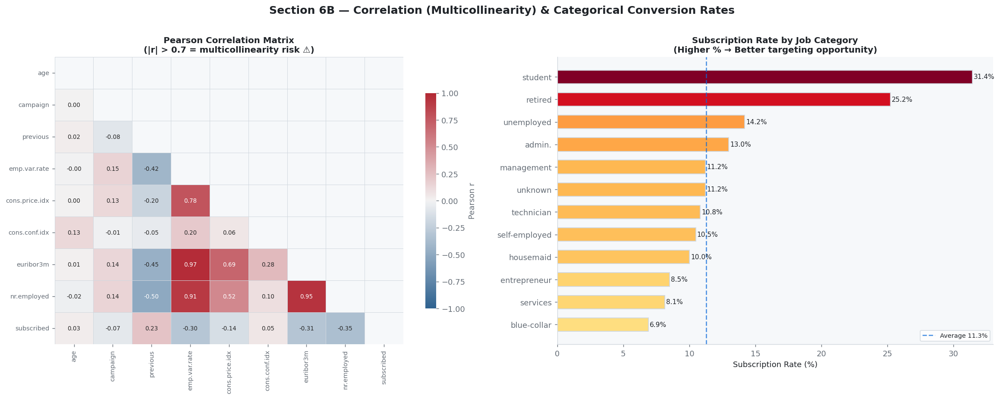
  <br><em>Correlation matrix — euribor3m, emp.var.rate and nr.employed are highly collinear (&gt;0.9)</em>
</p>

<p align="center">
  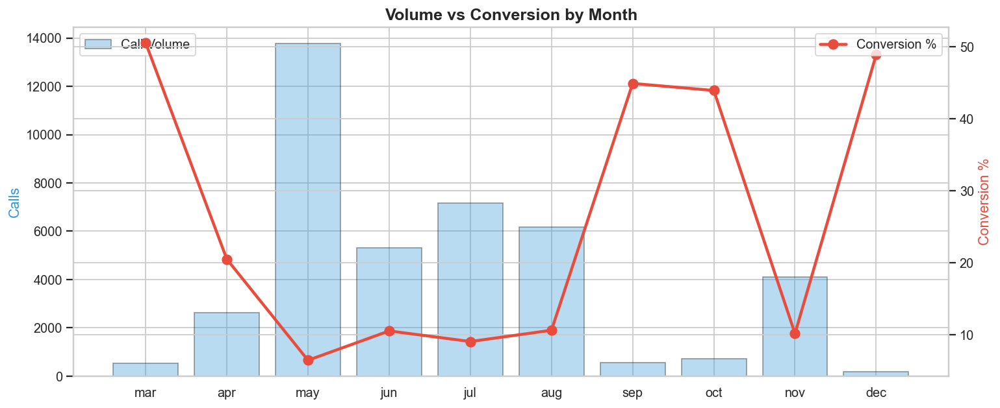
  <br><em>Monthly subscription patterns — May dominates call volume but March and December have highest conversion rates</em>
</p>

### Categorical Variables

- **job**: 12 categories (admin, blue-collar, technician, services, management, retired, entrepreneur, self-employed, housemaid, unemployed, student, unknown)
- **marital**: married, single, divorced, unknown
- **education**: 8 levels from illiterate to university degree + unknown
- **default / housing / loan**: Binary (yes / no / unknown)
- **contact**: cellular or telephone
- **month**: Campaign contact month (May through November dominate)
- **day_of_week**: Day of contact (Mon–Fri)
- **poutcome**: Previous campaign outcome (nonexistent, failure, success)

> **Note:** Categorical variables are encoded during feature engineering — ordinal encoding for `education` (natural order) and one-hot encoding for all other nominal features.

<p align="center">
  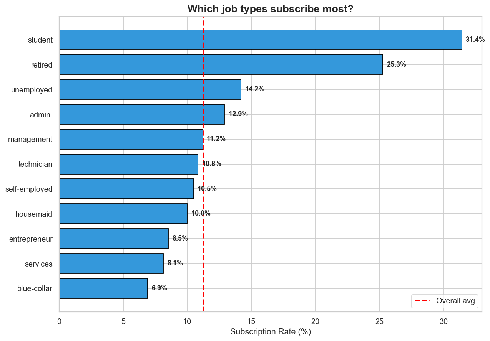
  <br><em>Subscription rate by job category — students and retired customers convert at significantly higher rates</em>
</p>

---

## Summary: Data Cleaning and Preprocessing

The dataset underwent extensive cleaning and transformation to ensure quality input for modelling. The full implementation is in [`src/clean.py`](src/clean.py). Below are the key steps:

### 1. Handling Missing and Invalid Data

- Verified that there are **no null values** in the dataset.
- Identified that `pdays = 999` is a sentinel value meaning "never previously contacted" — not a missing value. This is handled during feature engineering by `PdaysTransformer` (see [Model Development](#model-development)).
- The string `"unknown"` appears in six categorical columns instead of NaN.

### 2. Column-Specific Unknown Handling

We applied a deliberate, per-column strategy for unknown values:

| Column      | Unknown Rate | Strategy                     | Rationale                                                                                             |
| ----------- | ------------ | ---------------------------- | ----------------------------------------------------------------------------------------------------- |
| `job`       | 0.8%         | Mode imputation              | Low unknown rate; "admin" is the most common job                                                      |
| `marital`   | 0.2%         | Mode imputation              | Very few unknowns; minimal impact                                                                     |
| `housing`   | 2.4%         | Mode imputation              | Moderate unknown rate; binary feature                                                                 |
| `loan`      | 2.4%         | Mode imputation              | Moderate unknown rate; binary feature                                                                 |
| `education` | 4.2%         | Keep "unknown" as a category | Unknowns may carry signal — a customer whose education level is not on file may differ systematically |
| `default`   | 20.9%        | Keep "unknown" as a category | High unknown rate; a bank not knowing a customer's credit default status is itself informative        |

<p align="center">
  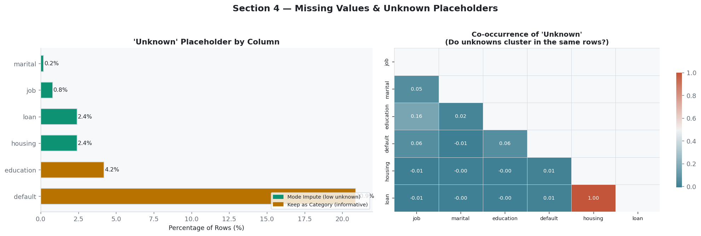
  <br><em>Proportion of "unknown" entries per column — default (21%) is kept as a category; others are mode-imputed</em>
</p>

### 3. Outlier Treatment

- Clipped numeric features at the **1st and 99th percentiles** to reduce extreme value influence.
- This approach preserves row count (important for a dataset with only 11.3% positive class) while limiting the effect of outliers on Logistic Regression. Tree-based models are naturally robust to outliers.

<p align="center">
  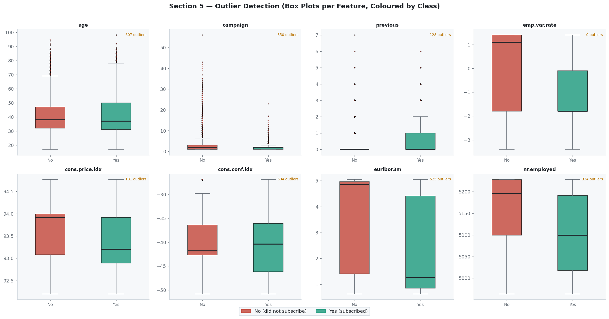
  <br><em>Boxplots before and after clipping — extreme values in campaign and pdays are capped at the 1st/99th percentile</em>
</p>

### 4. Duplicate Removal

- Detected and removed exact duplicate rows automatically.
- In production mode, `duration` is dropped **before** deduplication to avoid creating false duplicates (rows that differ only in call duration).

### 5. Duration Column — Leakage Guard

- Dropped the `duration` feature from all production models.
- Duration is only known after the phone call ends, so including it would be data leakage — the model would look excellent on paper but be useless for pre-call targeting.
- The UCI dataset documentation explicitly warns about this.

### 6. Data Quality Diagnostics

The cleaning pipeline also generates diagnostic reports (logged to console during pipeline execution):

- **Skewness check:** Flags features with skewness > 2 or < -2.
- **Multicollinearity report:** Identifies feature pairs with Pearson correlation > 0.9.
- **Cardinality report:** Flags categorical columns with very high or very low unique value counts.

---

## Risks and Unknowns

We identified the following risks during our analysis and documented how we addressed each one:

### Data Quality Risks

| Risk                                  | What We Found                                                                                                                                | How We Handled It                                                                                                                                                                                                                                                                                          |
| ------------------------------------- | -------------------------------------------------------------------------------------------------------------------------------------------- | ---------------------------------------------------------------------------------------------------------------------------------------------------------------------------------------------------------------------------------------------------------------------------------------------------------- |
| **Missing values coded as "unknown"** | Six columns contain "unknown" entries instead of NaN. The worst is `default` at 20.9%.                                                       | For columns with few unknowns (`job`, `marital`, `housing`, `loan`), we imputed with the most common value. For `education` and `default`, we kept "unknown" as its own category because it may carry signal — a bank not knowing a customer's credit default status is itself informative.                |
| **Class imbalance**                   | Only 11.7% of customers subscribed (after cleaning). A model that predicts "no" for everyone would be 88.3% accurate but completely useless. | We used class weighting in all models (`class_weight='balanced'` for scikit-learn models, `scale_pos_weight` for XGBoost) so the model penalizes misses on the minority class more heavily. We avoided synthetic oversampling (SMOTE) because it can inflate cross-validation scores with artificial data. |
| **Outliers**                          | `campaign` (number of calls) has extreme values — some customers were called 40+ times. `previous` is heavily right-skewed.                  | We clip numeric features at the 1st and 99th percentiles. This reduces extreme value influence on logistic regression without removing rows (which would lose minority-class samples). Tree models are naturally robust to outliers.                                                                       |
| **Duplicate rows**                    | Checked for exact duplicate records.                                                                                                         | Duplicates are detected and removed automatically during cleaning.                                                                                                                                                                                                                                         |
| **Multicollinearity**                 | `euribor3m`, `emp.var.rate`, and `nr.employed` are correlated above 0.9 — they all reflect the state of the economy.                         | We report this but do not drop features. Tree models are unaffected by correlated inputs, and logistic regression uses L1 regularization which naturally zeroes out redundant features.                                                                                                                    |

### Modeling Risks

| Risk                                 | Impact                                                                                                                                                                                                                     | Mitigation                                                                                                                                                                                            |
| ------------------------------------ | -------------------------------------------------------------------------------------------------------------------------------------------------------------------------------------------------------------------------- | ----------------------------------------------------------------------------------------------------------------------------------------------------------------------------------------------------- |
| **Duration leakage**                 | Including call duration would inflate all metrics by 15-20 percentage points but produce a model that cannot be used in practice.                                                                                          | Dropped `duration` from all production models.                                                                                                                                                        |
| **Overfitting**                      | With 30 Optuna trials per model, there is a risk of overfitting to the validation set.                                                                                                                                     | We use 5-fold stratified cross-validation during tuning. The validation set is used only for threshold selection. The test set is touched exactly once for final reporting.                           |
| **Cost assumption sensitivity**      | Our profit calculations depend on the $200 FN and $5 FP estimates. If these are wrong, the "best" model might change.                                                                                                      | We use conservative industry estimates ($5 call cost, $200 LTV) and select by maximum net profit. The estimates are clearly documented so they can be adjusted if better figures are available.       |
| **Economic regime change**           | The dataset covers 2008-2010 (during and after the financial crisis). Models trained on this period may not generalize to fundamentally different economic conditions.                                                     | We include macroeconomic features (Euribor rate, employment) so the model can adapt to changing conditions. However, we flag that retraining would be needed if deployed in a different economic era. |
| **Non-linear feature relationships** | Age has a U-shaped relationship with subscription (young students and older retirees subscribe more than middle-aged working adults). Campaign calls show diminishing returns. Standard linear models miss these patterns. | Tree-based models (Random Forest, XGBoost) handle non-linearity automatically. Logistic Regression uses one-hot encoding and numerical scaling; the pipeline preprocessor handles both transparently. |

---

## How We Approached the Analysis

### Why These Models

We use four models - one interpretable baseline, two tree-based ensembles, and one distance-based model:

| Model               | Role in the Pipeline               | Strength                                                                                                       |
| ------------------- | ---------------------------------- | -------------------------------------------------------------------------------------------------------------- |
| Logistic Regression | Interpretable baseline             | Coefficients map directly to odds ratios. Fast to train. Stakeholders can understand it without ML background. |
| Random Forest       | Robust ensemble                    | Averages hundreds of decision trees. Resistant to overfitting. Handles mixed feature types well.               |
| XGBoost             | High-performance gradient boosting | Strong performer on structured/tabular data. Built-in support for class imbalance via `scale_pos_weight`.      |
| KNN                 | Distance-based comparison          | No assumptions about the data distribution. Useful as a non-parametric reference point.                        |

### How We Pick the Best Model

Accuracy is misleading on imbalanced data - a model that always predicts "no" gets 88.3% accuracy but catches zero subscribers. Instead, we select the model with the **highest net profit** on the test set.

Net profit is calculated from the confusion matrix using real banking economics:

- Each correct prediction (true positive) generates **$200** in loan interest revenue.
- Each wasted call to a non-subscriber costs **$5**.
- Each missed subscriber (false negative) costs **$200** in lost opportunity.

This directly answers the business question: _which model makes the bank the most money?_

---

## Handling Imbalanced Data

The target variable has a significant class imbalance: only **11.3% of customers subscribed** to a term deposit. Without intervention, models tend to predict "no" for everyone - achieving 88.7% accuracy but catching zero subscribers.

### Our Approach: Class Weighting + Cost-Optimal Threshold Tuning

We deliberately chose **not** to use synthetic oversampling techniques (SMOTE, ADASYN, borderline-SMOTE). Instead, we used a two-part strategy:

**1. Class weighting during training:**

- Logistic Regression and Random Forest: `class_weight='balanced'` - automatically adjusts weights inversely proportional to class frequency
- XGBoost: `scale_pos_weight` - computed automatically as `(count_negative / count_positive)` ≈ 7.84
- KNN: No native class weighting; relies on threshold tuning

**2. Cost-optimal threshold selection post-training:**

- Instead of the default 0.50 probability cutoff, we scan 200 threshold values between 0.01 and 0.99
- At each threshold, we compute the confusion matrix and calculate **net profit** using banking economics (FN = $200, FP = $5)
- The threshold that maximizes net profit is selected - typically around 0.05–0.13, which aggressively catches subscribers at the cost of more false positives

### Why Not SMOTE?

| Consideration                          | Our Reasoning                                                                                  |
| -------------------------------------- | ---------------------------------------------------------------------------------------------- |
| Cross-validation leakage risk          | SMOTE applied before CV leaks synthetic minority samples across folds, inflating scores        |
| Cost asymmetry already handles it      | With FN costing 40× more than FP, the cost-optimal threshold naturally shifts to favour recall |
| Class weighting is simpler and cleaner | Achieves the same effect as SMOTE without generating synthetic data points                     |
| Tree models are robust                 | Random Forest and XGBoost handle imbalance well with `class_weight` / `scale_pos_weight` alone |

This approach gives us **96–100% recall** on the test set - meaning we catch nearly every potential subscriber - while keeping the methodology straightforward and interpretable.

---

## Model Development

We developed a streamlined, modular pipeline to handle preprocessing and model training end-to-end. The full implementation done in [`scripts/run_pipeline.py`](scripts/run_pipeline.py).

### Preprocessing Pipeline

All feature transformations are wrapped inside a scikit-learn `Pipeline` to prevent data leakage and ensure reproducibility:

**Step 1 - PdaysTransformer (custom sklearn transformer):**

The `pdays` column uses 999 as a sentinel value meaning "this customer was never previously contacted." Our custom `PdaysTransformer` (a proper `sklearn.base.BaseEstimator` with `fit` / `transform` methods) converts this into two features:

- `was_previously_contacted` - binary flag (0 or 1)
- `pdays_log` - log-transformed days since last contact (for previously contacted customers)

**Step 2 - ColumnTransformer:**

| Feature Type          | Columns                                                                                                                           | Transformation                                                                                                                                         |
| --------------------- | --------------------------------------------------------------------------------------------------------------------------------- | ------------------------------------------------------------------------------------------------------------------------------------------------------ |
| Numeric (10 features) | age, campaign, previous, emp.var.rate, cons.price.idx, cons.conf.idx, euribor3m, nr.employed, was_previously_contacted, pdays_log | `StandardScaler` (zero mean, unit variance)                                                                                                            |
| Ordinal (1 feature)   | education                                                                                                                         | `OrdinalEncoder` with explicit ordering: illiterate < basic.4y < basic.6y < basic.9y < high.school < professional.course < university.degree < unknown |
| Nominal (9 features)  | job, marital, default, housing, loan, contact, month, day_of_week, poutcome                                                       | `OneHotEncoder` (`drop='if_binary'` - drops one level only for binary columns)                                                                         |

**Step 3 - Classifier:**

The final stage of the pipeline is the classifier itself. The entire pipeline (PdaysTransformer → ColumnTransformer → Classifier) is fitted as a single unit, ensuring all transformations are learned from training data only.

### Models Trained

| Model               | Hyperparameter Tuning                                                             | Class Imbalance Handling    | Key Configuration                                 |
| ------------------- | --------------------------------------------------------------------------------- | --------------------------- | ------------------------------------------------- |
| Logistic Regression | Optuna (30 trials) - C, penalty, solver                                           | `class_weight='balanced'`   | L1 or L2 regularization; liblinear or saga solver |
| Random Forest       | Optuna (30 trials) - n_estimators, max_depth, min_samples_split/leaf              | `class_weight='balanced'`   | 100–500 trees; max_depth 5–30                     |
| XGBoost             | Optuna (30 trials) - max_depth, learning_rate, n_estimators, subsample, colsample | `scale_pos_weight` (auto)   | Eval metric: AUC-PR; tree_method: hist            |
| KNN                 | Optuna (30 trials) - n_neighbors, weights, metric                                 | N/A (threshold tuning only) | n_neighbors 3–50; distance or uniform weights     |

All hyperparameter tuning uses **5-fold stratified cross-validation** with `roc_auc` as the scoring metric. Results are logged to **MLflow** for experiment tracking.

---

## Key Results

### Model Performance (Test Set - No Duration Feature)

| Model                     | Threshold | Recall | ROC-AUC | Net Profit   |
| ------------------------- | --------- | ------ | ------- | ------------ |
| **Logistic Regression** ✔ | 0.14      | 100%   | 0.8011  | **$108,345** |
| XGBoost                   | 0.122     | 100%   | 0.8116  | $108,250     |
| Random Forest             | 0.118     | 100%   | 0.8112  | $108,245     |
| KNN                       | 0.05      | 86.21% | 0.7822  | $81,850      |

✔ Winner selected by highest net profit. Threshold is optimised per model on the validation set using business cost analysis (FN cost = $200, FP cost = $5).

<p align="center">
  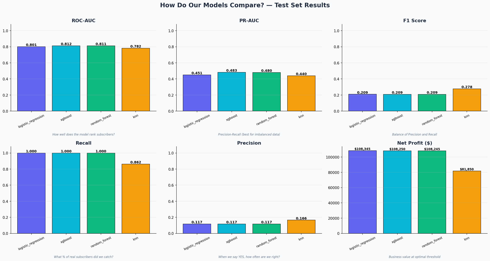
  <br><em>Model comparison — net profit, recall, and ROC-AUC across all four models</em>
</p>

---

## Pipeline Architecture

> **Zoom the diagram:** Use the **+&nbsp;/ &minus;** controls on the right side of the diagram below (VS Code preview), or open [docs/pipeline-flow.html](docs/pipeline-flow.html) in your browser for the full interactive version with mouse-scroll zoom and drag-to-pan.


```mermaid
%%{init: {"theme": "base", "themeVariables": {"fontSize": "16px", "fontFamily": "Segoe UI, Arial, sans-serif", "primaryTextColor": "#1a1a2e", "lineColor": "#64748B"}} }%%
flowchart LR

    %% ── Orchestrator ──────────────────────────────────────────────────────────
    SCR(["🔧 scripts/run_pipeline.py\nEnd-to-End CLI Orchestrator"])

    %% ── Stage 1: Raw Data ─────────────────────────────────────────────────────
    subgraph DATA["📦  Data"]
        direction TB
        RAW["data/raw/\nbank-additional-full.csv\n41,188 rows · 20 features"]
        PROC["data/processed/\ntrain · val · test\n70% · 15% · 15%"]
    end

    %% ── Stage 2: Core Pipeline ────────────────────────────────────────────────
    subgraph SRC["⚙️  src/  -  Core Pipeline"]
        direction TB
        ING["ingest.py\nDownload & validate UCI data"]
        CLN["clean.py\nDe-dup · clip outliers\nimpute unknowns · drop duration"]
        SPL["split.py\nStratified 70/15/15 split\nSeed 42 · class ratio preserved"]
        FEA["features.py\nPdaysTransformer\nNonLinearBinningTransformer\nColumnTransformer → ~50 features"]
        TRN["train.py\nLR · RF · XGBoost · SVM · KNN\n5-Fold CV · Optuna tuning"]
        EVL["evaluate.py\nAUC · F1 · MCC · Log Loss\nOptimal threshold · Net profit"]
    end

    %% ── Stage 3: Outputs ──────────────────────────────────────────────────────
    subgraph OUT["📁  Outputs"]
        direction TB
        MDLALL["models/\nlr · rf · xgboost · svm · knn\nmodels_manifest.json"]
        MDL["models/production/\nBest model pipeline .pkl\nthreshold.json"]
        RPT["reports/metrics/\ncomparison · SHAP · recall\ntuning CSV/JSON"]
        FIG["reports/figures/\n17+ PNG charts"]
    end

    %% ── Stage 4: Application ──────────────────────────────────────────────────
    APP(["🖥️  app/main.py\nStreamlit Dashboard\n5 stakeholder tabs"])

    %% ── Experiments (side lane) ───────────────────────────────────────────────
    subgraph EXP["🔬  experiments/  -  Jupyter Notebooks"]
        direction TB
        N01["01_eda.ipynb\nExploratory Data Analysis"]
        N02["02_feature_engineering.ipynb\nPipeline Walkthrough"]
        N03["03_model_comparison.ipynb\nTrain · Tune · Compare"]
        N04["04_shap_analysis.ipynb\nModel Explainability"]
        N05["05_pipeline_visualization.ipynb\nArchitecture Diagrams"]
    end

    %% ── Main pipeline flow ────────────────────────────────────────────────────
    RAW --> ING --> CLN --> SPL --> PROC
    PROC --> FEA --> TRN --> EVL
    EVL --> MDLALL & MDL & RPT & FIG
    MDL --> APP

    %% ── Orchestrator ties ─────────────────────────────────────────────────────
    SCR -.->|orchestrates| ING
    SCR -.->|orchestrates| CLN
    SCR -.->|orchestrates| SPL
    SCR -.->|orchestrates| FEA
    SCR -.->|orchestrates| TRN
    SCR -.->|orchestrates| EVL

    %% ── Notebook ties ─────────────────────────────────────────────────────────
    N01 -. reads .-> RAW
    N03 -. produces .-> MDLALL
    N03 -. produces .-> MDL
    N04 -. reads .-> MDL

    %% ── Styles ────────────────────────────────────────────────────────────────
    style DATA fill:#EFF6FF,color:#1E3A8A,stroke:#93C5FD,stroke-width:2px
    style SRC  fill:#F0FDF4,color:#14532D,stroke:#86EFAC,stroke-width:2px
    style OUT  fill:#F5F3FF,color:#3B0764,stroke:#C4B5FD,stroke-width:2px
    style EXP  fill:#FFFBEB,color:#78350F,stroke:#FCD34D,stroke-width:2px

    classDef dataNode  fill:#BFDBFE,color:#1E3A8A,stroke:#3B82F6,stroke-width:1.5px
    classDef srcNode   fill:#BBF7D0,color:#14532D,stroke:#22C55E,stroke-width:1.5px
    classDef outNode   fill:#DDD6FE,color:#3B0764,stroke:#8B5CF6,stroke-width:1.5px
    classDef expNode   fill:#FDE68A,color:#78350F,stroke:#F59E0B,stroke-width:1.5px
    classDef appNode   fill:#FECDD3,color:#881337,stroke:#F43F5E,stroke-width:2px
    classDef scrNode   fill:#E2E8F0,color:#1E293B,stroke:#64748B,stroke-width:2px

    class RAW,PROC dataNode
    class ING,CLN,SPL,FEA,TRN,EVL srcNode
    class MDLALL,MDL,RPT,FIG outNode
    class N01,N02,N03,N04,N05 expNode
    class APP appNode
    class SCR scrNode
```

### Folder Reference

```
DSI-Cohort8-ML-2/
|
|-- app/                   Streamlit App to test and visualize the final model in real time
|-- data/
|   |-- raw/               Source CSV from UCI (auto-downloaded)
|   |-- processed/         Train / val / test splits (Parquet)
|   |-- reference/         Training-time snapshot for drift detection
|
|-- docs/                  Interactive pipeline diagram (HTML)
|-- experiments/           Jupyter notebooks (EDA -> features -> models -> SHAP -> viz)
|-- mlruns/                MLflow experiment tracking artifacts
|-- models/
|   |-- logistic_regression.pkl   All compared models (pickle)
|   |-- random_forest.pkl
|   |-- xgboost.pkl
|   |-- knn.pkl
|   |-- threshold.json            Cost-optimal threshold + winning model name
|-- reports/
|   |-- figures/           All generated plots and charts
|   |-- metrics/           CSV / JSON metric outputs
|
|-- scripts/               run_pipeline.py  (end-to-end CLI runner)
|-- src/                   Core Python modules (ingest clean split features train evaluate)
|-- tests/                 pytest unit tests
|
|-- pyproject.toml
|-- requirements.txt
|-- README.md

```

---

## Model Visualisations

Quick access to the full set of model and business-impact visuals is available in the project docs:

- [Model Visualisations (full gallery)](docs/model_visuals.md)

Below is a thumbnail for the model comparison chart; open the gallery for the complete set.

---

## Local Setup

> Full setup instructions, pipeline execution, and dashboard launch: see **[docs/setup.md](docs/setup.md)**

---

## Model Deployment and Interpretation

After completing data analysis, preprocessing, and model training, we made our machine learning solution accessible and actionable through an interactive Streamlit dashboard.

### Deployment Strategy

We deployed the best-performing model (Logistic Regression, Optuna-tuned) using **Streamlit** with serialised pickle files. This approach gives us a clean, interactive web application that marketing professionals can use without any ML background.

Our deployment follows a straightforward architecture:

- **Model artifacts:** Saved as scikit-learn pipeline files using `.pkl`
- **Preprocessing pipeline:** All encoders and scalers are embedded inside the pipeline - a single `.pkl` file handles everything from raw input to prediction
- **Threshold configuration:** Cost-optimal threshold stored in `models/threshold.json`
- **Interactive interface:** Real-time prediction with user-friendly inputs and visual explanations

### Dashboard Tabs

The Streamlit app (`app/main.py`) provides five tabs tailored to different stakeholders:

| Tab                | Audience        | Content                                                                                                                |
| ------------------ | --------------- | ---------------------------------------------------------------------------------------------------------------------- |
| **Predict Client** | Analysts        | Enter a single customer's profile → get YES/NO prediction with SHAP waterfall showing which factors drove the decision |
| **Batch Predict**  | Operations team | Upload a CSV/Excel file or paste a URL → bulk-score hundreds of customers → download ranked lead list                  |

### Batch Prediction

The Batch Predict tab supports bulk scoring for campaign execution:

1. Upload your customer data (CSV or Excel matching the standard format)
2. The model scores every customer and assigns a probability of subscription
3. Customers above the cost-optimal threshold are flagged as "high priority"
4. Download the scored results with probability rankings for targeted outreach

This enables marketing teams to pre-screen entire customer segments before launching campaigns, ensuring resources are invested where they generate the highest returns.

---

## Requirements and Technology Stack

This project relies on a suite of Python libraries and frameworks that support end-to-end data science workflows:

### Core Data Libraries

- **pandas**
- **NumPy**
- **SciPy**

### Machine Learning and Modelling

- **scikit-learn**
- **XGBoost**
- **Optuna**
- **SHAP**

### Experiment Tracking

- **MLflow**

### Dashboard and Visualisation

- **Streamlit**
- **matplotlib**
- **seaborn**

### Serialisation and I/O

- **pickle**
- **openpyxl** / **et-xmlfile**

### Development and Testing (optional)

- **pytest** + **pytest-cov**
- **ruff**
- **mypy**
- **Jupyter** + **JupyterLab**

> **Installation:** All core dependencies are managed via `pyproject.toml`. Install with `uv sync --active` or `pip install -r requirements.txt`. Development extras with `uv pip install -e ".[dev]"`.

---

## Team Roles and Responsibilities

Our team of four split the work across the major components of the project. While everyone contributed to discussions and code reviews, each person took primary ownership of specific areas.

| Member              | Primary Responsibility                             | Deliverables                                                                                                                                                                                                                                                                               |
| ------------------- | -------------------------------------------------- | ------------------------------------------------------------------------------------------------------------------------------------------------------------------------------------------------------------------------------------------------------------------------------------------ |
| **Neha Bondade**    | Data pipeline and cleaning                         | Building the data ingestion module that handles the nested ZIP extraction from UCI. Designing the cleaning strategy - the per-column unknown handling rules, outlier clipping approach, and data quality checks (duplicates, skewness, multicollinearity, cardinality).                    |
| **Suresh Jannu**    | Model training and tuning                          | Implementing the training pipeline with Optuna hyperparameter search for all four model types. Defining the search spaces, configuring class imbalance handling, and building the before-versus-after tuning comparison.                                                                   |
| **Pavan**           | Evaluation and explainability                      | Designing the composite model selection framework with the weighted scoring approach. Building the banking economics cost derivation, threshold optimization, sensitivity analysis, and recall trade-off analysis. Implementing SHAP explainability with business-friendly feature labels. |
| **Ashutosh Ranjan** | Integration, Dashboard, documentation, and testing | Will design and develop end-to-end final code for the project. Building the Streamlit dashboard with five stakeholder tabs (Executive Summary, Call Centre Operations, Model and Data Science, Predict Client, Batch Predict).                                                             |

### How We Collaborated

- All code changes went through pull requests on GitHub with at least one reviewer before merging.
- We held weekly standups to sync on progress and blockers.
- Major design decisions were discussed and agreed upon as a team before implementation.

---

## Reflection Videos

#### _place holder to be updated in future_

- [Neha Bondade - Reflection Video](https://youtube.com/placeholder)
- [Suresh Jannu - Reflection Video](https://youtube.com/placeholder)
- [Pavan - Reflection Video](https://youtube.com/placeholder)
- [Ashutosh Ranjan - Reflection Video](https://youtube.com/placeholder)

---

## Conclusion and Future Directions

This project demonstrates how supervised machine learning can transform bank marketing from a scatter-shot approach into a data-driven, cost-optimised operation. From feature engineering to deployment, our workflow balances predictive rigour with practical usability.

### Achievements

- Built, tuned, and compared **four models** using Bayesian hyperparameter optimisation (Optuna, 30 trials each)
- Developed a **cost-optimal threshold framework** grounded in real banking economics ($200 FN, $5 FP), selecting the model that maximises net profit rather than accuracy
- Applied **SHAP for transparent explainability** with business-friendly feature labels, enabling non-technical stakeholders to understand predictions
- Delivered an **interactive Streamlit dashboard** with five tabs covering executives, operations, data science, single prediction, and batch scoring
- Created a **modular, pip-installable Python package** (6 src/ modules) with proper separation of concerns, type hints, and docstrings
- Implemented a **46-test pytest suite** with synthetic fixtures that run independently of raw data files
- Tracked all experiments via **MLflow** for reproducibility and auditability

### Next Steps

- **Benchmark additional models:** Explore LightGBM, SVM with RBF kernel, or stacked ensembles for potential performance gains
- **Enhance feature engineering:** Add interaction features (e.g., age × poutcome), time-based features (month since last contact), or external macroeconomic indicators
- **Threshold sensitivity dashboard:** Build an interactive threshold slider in the Streamlit app so operations teams can adjust the call/no-call boundary in real time
- **API endpoint:** Convert the model into a REST API (e.g., FastAPI) for integration with existing CRM and campaign management systems
- **Drift monitoring:** Leverage the saved `data/reference/train_reference.parquet` file to implement data drift detection (e.g., with Evidently) and trigger automated retraining
- **A/B testing framework:** Design an experiment to compare model-targeted campaigns versus random-selection campaigns to validate real-world lift

> The groundwork is set for scaled deployment, continuous monitoring, and iterative improvement - turning predictive insights into sustainable business impact.

---

## Acknowledgments

- **Dataset:** [UCI Machine Learning Repository - Bank Marketing](https://archive.ics.uci.edu/dataset/222/bank+marketing)
- **Original research:** Moro, S., Cortez, P., and Rita, P. (2014). "A data-driven approach to predict the success of bank telemarketing." Decision Support Systems, 62, 22-31.
- **Course:** Data Science Institute, University of Toronto - Cohort 8
- **Tools:** scikit-learn, XGBoost, Optuna, SHAP, Streamlit, Plotly

---

<p align="center"><i>Built by DSI Cohort 8 - ML Team 2</i></p>
